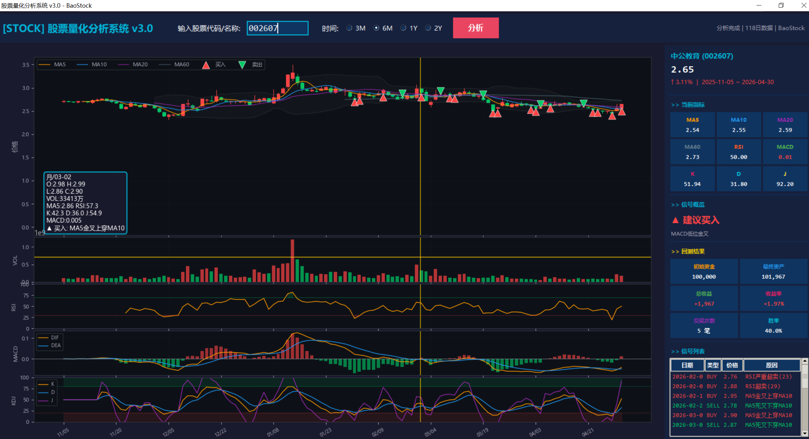

# 🚀 QUANTAXIS 股票量化分析系统 v3.0

> **一款专为 A 股投资者打造的可视化量化分析工具，零门槛上手，专业级体验。**

---

## ✨ 产品亮点

### 📊 五图联动，一目了然
K 线图、成交量、RSI、MACD、KDJ 五大核心指标**同屏联动展示**，鼠标移动时十字光标同步穿透所有子图，精准定位每一根 K 线对应的指标状态。

### 🔔 量化回测数据支撑
基于量化数据，进行回测给出买入与卖出的建议。

### 🔔 智能买卖信号
基于 MA 金叉死叉、RSI 超买超卖、KDJ 极值区、MACD 交叉等经典策略，自动在 K 线上标记 **▲买入 / ▼卖出** 信号点，并弹出消息提醒——让机会不再错过。

### 🎯 实时信息面板
右侧面板实时呈现：当前指标数值、信号概览建议、回测收益统计（初始资金 / 最终资产 / 收益率 / 胜率），决策依据清晰可见。

### ⚡ 即开即用，无需复杂配置
- 输入股票代码或名称（支持 200+ 常用 A 股名称映射）
- 选择时间范围（3个月 / 6个月 / 1年 / 2年）
- 一键「分析」，秒出结果
- 数据来源：BaoStock 免费接口，无需 API Key

### 🌙 深色主题 + 高对比度配色
深蓝底色搭配暖橙/冷蓝双色系，长时间盯盘不刺眼；买卖信号红绿分明，关键数据一眼锁定。

---

### 🖼️ 系统截图



*上图：中公教育(002607) 六个月 K 线分析 — 五图联动 + 十字光标同步 + 右侧指标/回测面板 + 买卖信号标记*

---

## 一、环境部署

本系统基于 Python 3.8 开发，以下是完整的依赖环境说明。

### 1.1 必需软件清单

| 软件 | 版本 | 用途 | 下载地址 |
|------|------|------|----------|
| Python | 3.8.5 | 运行环境 | https://www.python.org/downloads/windows/ |
| MongoDB | 8.2.x | 数据存储（可选，如用模式A） | https://www.mongodb.com/try/download/community |
| Git | 最新 | 版本控制 | https://git-scm.com/download/win |

### 1.2 Python 环境配置

**步骤1：安装 Python 3.8**

1. 访问 https://www.python.org/downloads/windows/
2. 下载 `Windows x86-64 executable installer`
3. 安装时**务必勾选** `Add Python 3.8 to PATH`（否则需手动配置环境变量）
4. 安装完成后验证：
   ```
   python --version
   # 应显示 Python 3.8.5
   ```

**步骤2：创建虚拟环境（推荐）**

```powershell
# 进入项目目录
cd F:\FilesData\QUANTAXIS

# 创建虚拟环境
python -m venv venv

# 激活虚拟环境（每次打开新终端都需执行）
# Windows:
venv\Scripts\activate

# 激活成功后命令行前会出现 (venv) 前缀
```

**步骤3：安装依赖包**

在虚拟环境激活状态下执行：

```powershell
# 安装核心依赖（一次性完成）
pip install pandas numpy matplotlib

pip install baostock pandas mplfinance

pip install akshare

pip install pymongo

pip install pillow
```

> **提示**：安装 akshare 时如果报 `aiohttp` 版本冲突，忽略警告继续即可，不影响功能。

### 1.3 MongoDB 配置（可选，仅模式A需要）

1. 下载 MongoDB Community Server（免费版）
2. 安装时选择 "Complete" 安装方式，安装目录建议 `D:\Program Files\MongoDB`
3. **创建数据目录**：
   ```
   D:\MongoDB\data\db
   ```
4. **启动 MongoDB 服务**：
   打开一个新的命令行窗口，执行：
   ```powershell
   mongod --dbpath D:\MongoDB\data\db
   ```
   服务窗口保持开着，不要关闭。

5. **验证 MongoDB 是否运行**：
   另开一个命令行窗口，执行：
   ```powershell
   mongo
   ```
   如果显示 `MongoDB shell version` 则表示连接成功，按 `exit` 退出。

### 1.4 启动项目（两种方式）

**方式一：使用虚拟环境（推荐）**

```powershell
# 1. 先激活虚拟环境
cd F:\FilesData\QUANTAXIS
venv\Scripts\activate

# 2. 启动GUI程序
python stock_gui.py

# 或双击运行
启动股票分析v3.bat
```

**方式二：使用 Python38 全局环境**

```powershell
& "D:\Program Files (x86)\Python\Python38\python.exe" "F:\FilesData\QUANTAXIS\stock_gui.py"
```

### 1.5 环境目录结构

```
F:\FilesData\QUANTAXIS\
├── stock_gui.py        # 主程序
├── 启动股票分析v3.bat  # 双击启动脚本
├── venv/               # 虚拟环境（安装依赖后有效）
│   └── Scripts/
├── 使用指南.md         # 本文件
├── README_GUI.md      # GUI说明
├── 量化交易完整指南.md  # 学习路径
└── MongoDB安装指南.md  # MongoDB详细配置
```

### 1.6 常见环境问题

| 问题 | 解决方法 |
|------|----------|
| `python` 找不到命令 | 手动添加 Python 到 PATH，或使用完整路径 `D:\Program Files (x86)\Python\Python38\python.exe` |
| `pip` 报版本冲突 | 忽略，继续安装其他包，不影响使用 |
| MongoDB 连接失败 | 确认 `mongod --dbpath D:\MongoDB\data\db` 服务已启动，端口默认 27017 |
| 程序闪退 | 用命令行运行查看错误信息 |

---

## 二、QUANTAXIS 两种数据模式

### 模式A：MongoDB 模式（完整功能）
QUANTAXIS 默认使用 MongoDB 存储数据，支持：
- 本地数据缓存，查询速度快
- 多数据源统一管理
- 回测引擎完整功能

**需要安装 MongoDB**：
1. 下载：https://www.mongodb.com/try/download/community
2. 安装后启动服务：`mongod --dbpath D:\MongoDB\data`
3. 初始化数据：
```python
import QUANTAXIS as QA
QA.QA_save_stock_list()  # 保存股票列表到MongoDB
```

### 模式B：Akshare 直连模式（推荐新手）
无需 MongoDB，直接在线获取数据，简单易用。

---

## 三、Akshare 常用接口

```python
import akshare as ak

# 1. 获取股票列表
stocks = ak.stock_zh_a_spot_em()  # 全部A股实时行情
print(len(stocks))  # 约5400只

# 2. 获取日K线
df = ak.stock_zh_a_hist(
    symbol="002285",      # 股票代码
    period="daily",       # daily/weekly/monthly
    start_date="20260101",
    end_date="20260430",
    adjust="qfq"          # qfq前复权/hfq后复权/None不复权
)

# 3. 获取实时行情
realtime = ak.stock_zh_a_spot_em()
stock = realtime[realtime["代码"] == "002285"]

# 4. 获取财务数据
# 业绩报告
report = ak.stock_financial_abstract(symbol="002285")

# 5. 获取板块数据
sectors = ak.stock_board_industry_name_em()  # 行业板块
```

---

## 四、QUANTAXIS 回测示例（需MongoDB）

```python
import QUANTAXIS as QA

# 创建账户
account = QA.QA_Account()

# 获取数据
data = QA.QA_fetch_stock_day('000001', '2020-01-01', '2023-12-31')

# 简单策略：均线交叉
def strategy(data):
    ma5 = data['close'].rolling(5).mean()
    ma20 = data['close'].rolling(20).mean()
    signal = (ma5 > ma20).astype(int)
    return signal

# 运行回测
backtest = QA.QA_Backtest(
    strategy=strategy,
    data=data,
    account=account
)
result = backtest.run()
```

---

## 五、推荐学习路径

1. **入门**：用 Akshare 获取数据，用 Pandas 分析
2. **进阶**：学习 Backtrader 回测框架
3. **实盘**：VNPY 完整交易系统

---

## 六、常见问题

**Q: QUANTAXIS 导入报错 "wrong version"？**
A: 这是警告信息，不影响使用。拦截 sys.exit 即可：
```python
import sys
sys.exit = lambda c=0: None
import QUANTAXIS as QA
```

**Q: MongoDB 连接失败？**
A: 确保已安装并启动 MongoDB 服务，默认端口 27017。

**Q: 数据获取慢？**
A: Akshare 是在线获取，首次较慢。建议用 MongoDB 模式缓存本地。